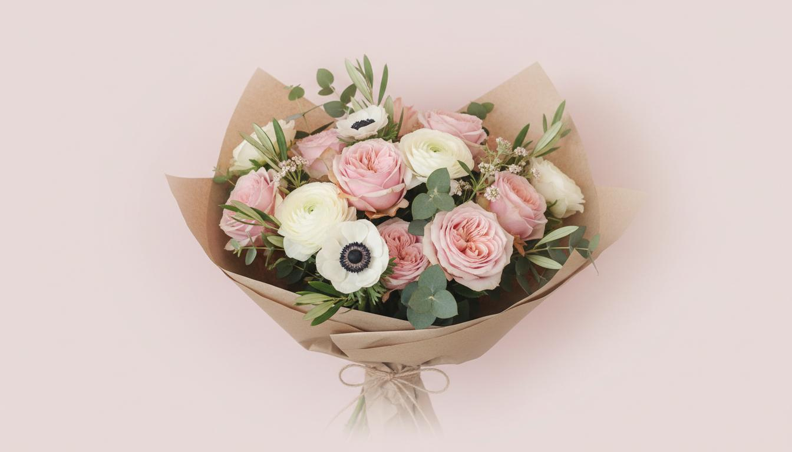
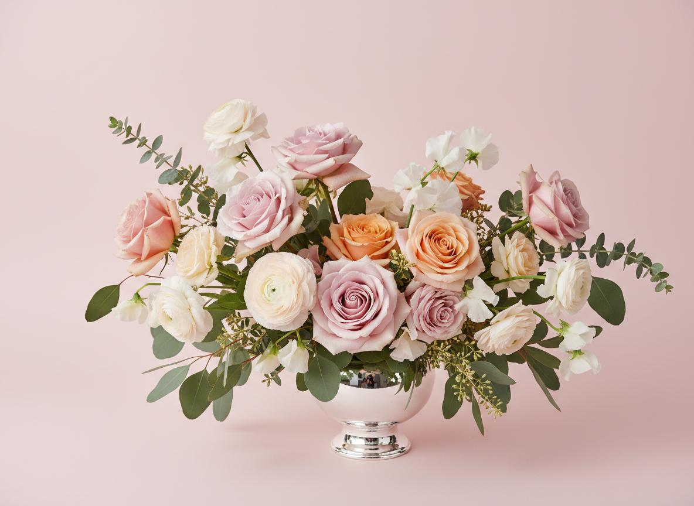
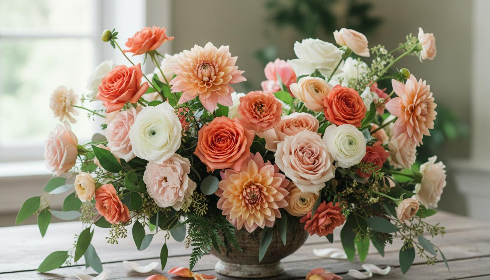
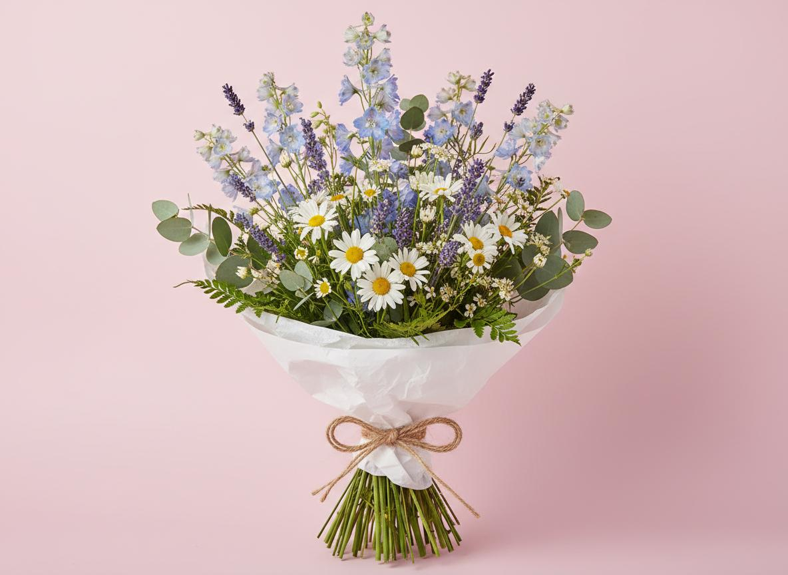

# Velvet Rose

<p align="center">
	
</p>

<p align="center">
	<strong>Timeless romance meets modern botanical artistry.</strong>
</p>

<p align="center">
	A premium florist storefront experience crafted with rich motion, elegant typography, and editorial-style layouts.
</p>

<p align="center">
	
	
	
	
	
</p>

---

## Why This Project Stands Out

Velvet Rose is not just a template. It is a complete visual concept for a modern florist brand, combining:

- Editorial-inspired composition with romantic spacing and soft depth
- Motion language based on bloom, drift, and organic reveal patterns
- Premium e-commerce style interactions for discovery and add-to-cart moments
- Strong design token foundation for color, typography, and atmosphere

The design direction is grounded in a clear brand narrative and detailed section choreography documented in [Design.md](./Design.md).

---

## Live Experience Sections

The app is composed of polished, reusable sections that create a full storytelling journey:

- Hero introduction with immersive floral atmosphere
- About story section with layered visual rhythm
- Shop by category with curated product pathways
- Products grid for bouquet discovery
- Features and trust-focused value messaging
- Testimonials for social proof
- Final CTA conversion block

---

## Screenshots

### Core Experience

| Hero | About |
|---|---|
|  |  |

| Features | Call To Action |
|---|---|
|  |  |

### Categories

| Roses | Peonies | Tulips | Ranunculus |
|---|---|---|---|
|  |  |  |  |

### Product Showcase

| White Roses | Pink Peonies | Coral Roses |
|---|---|---|
|  |  |  |

| Bridal Collection | Single Rose | Wildflowers |
|---|---|---|
|  |  |  |

### Social Proof

| Customer 1 | Customer 2 | Customer 3 |
|---|---|---|
|  |  |  |

---

## Tech Stack

- React 19 + TypeScript
- Vite 7
- Tailwind CSS
- GSAP and @gsap/react
- Radix UI primitives
- Utility ecosystem: clsx, class-variance-authority, tailwind-merge

---

## Project Structure

```text
VelvetRose/
├─ README.md
├─ Design.md
├─ hero-bouquet.jpg
├─ ...image assets
└─ app/
	 ├─ src/
	 │  ├─ sections/
	 │  ├─ components/
	 │  ├─ hooks/
	 │  └─ data/
	 ├─ public/
	 └─ package.json
```

---

## Getting Started

### 1. Install dependencies

```bash
cd app
npm install
```

### 2. Run development server

```bash
npm run dev
```

### 3. Build for production

```bash
npm run build
```

### 4. Preview production build

```bash
npm run preview
```

---

## Brand Tokens

- Primary: `#f76b6c`
- Secondary: `#ffb4b4`
- Background: `#fff9f9`
- Text: `#352e2d`
- Display Font: Ovo
- Body Font: Open Sans

---

## Notes

- The main app lives inside the `app` directory.
- Root-level image assets are included and reused by the app/public folder.
- Design and motion direction are documented in detail in [Design.md](./Design.md).

---

## License

Open-source and free to use for creative, educational, and portfolio projects.
